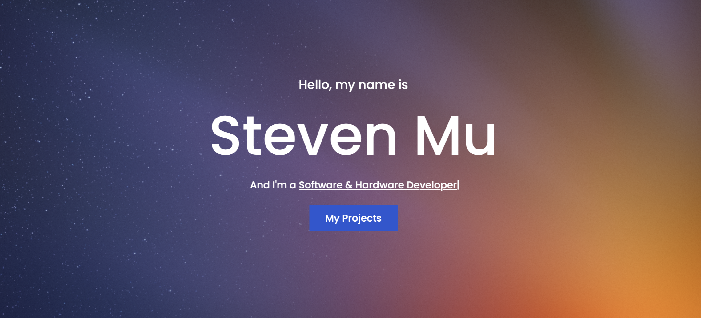

## Hello, My name is Steven 👋

Welcome to my github profile. Here you can find all the repositories for my current / past projects. I am currently a student at the University of Waterloo studying Computer Engineering.

For more info about these projects or myself, please visit my website:
https://steven-portfolio-12.web.app

 

  
  
  
  
    
  
   

  
   

   
  

<!--
**steven-mu12/steven-mu12** is a ✨ _special_ ✨ repository because its `README.md` (this file) appears on your GitHub profile.

Here are some ideas to get you started:

- 🔭 I’m currently working on ...
- 🌱 I’m currently learning ...
- 👯 I’m looking to collaborate on ...
- 🤔 I’m looking for help with ...
- 💬 Ask me about ...
- 📫 How to reach me: ...
- 😄 Pronouns: ...
- ⚡ Fun fact: ...
-->
